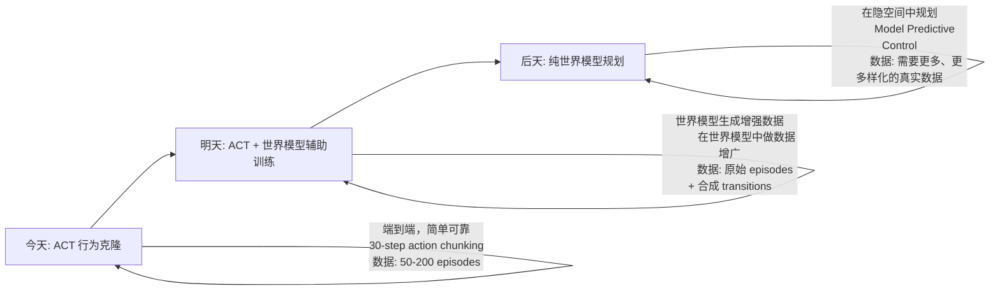

# 第一章 系统总览

本章是教程的起点。你将了解 PiPER 双臂协作机器人 + LeRobot 模仿学习流水线的全貌——从"人是怎么教的"到"机器是怎么学的"，从最底层的 CAN 总线信号到最上层的神经网络策略，建立一套完整的心智模型。

学完本章后，你应该能够回答以下问题：

- 这套系统的输入是什么，输出是什么？
- 硬件是怎么连在一起的（拓线图、CAN 拓扑、相机布局）？
- 数据从机械臂编码器流到训练数据集的每一步发生了什么？
- 归一化到底是干什么的？为什么需要它？
- 代码仓库里每个目录是做什么的？

如果某些术语不理解，可以直接翻到 1.5 节查询术语表。如果想知道"这段代码到底在哪里"，可以翻到 1.6 节的代码仓库结构图。

---

## 1.1 项目是什么

### 1.1.1 名字的含义

本项目由两个核心组件组成：

| 组件 | 全称 | 在本项目中的角色 |
|------|------|-------------------|
| **PiPER** | 松灵机器人（AgileX）出品的桌面级 6 轴协作机械臂 | 硬件平台：执行动作、反馈状态 |
| **LeRobot** | HuggingFace 开源的一套模仿学习框架 | 软件框架：采集数据、训练策略、部署推理 |

两者结合在一起，构成了一条完整的**模仿学习流水线**（Imitation Learning Pipeline）。

## 机器人学关键概念：连接 PiPER 的设计选择

要理解 PiPER + LeRobot 流水线中的每一个设计决定，我们需要先建立一套机器人学的基础词汇。下面这些概念不是枯燥的教科书定义——每一个都会直接映射到你在本项目代码中看到的某个参数、某个 CAN 命令、或者某个策略输出维度。

---

### 1. 自由度 (DOF) 与机械臂构型

#### 什么是自由度

在机器人学中，**一个自由度（Degree of Freedom, DOF）就是一个独立的运动方向**。想象一扇门：它只能绕铰链轴旋转（打开或关上），所以它有 1 个自由度。想象你的手指：每个指节可以弯曲和伸展，不同关节可以独立运动，所以一只手有 20+ 个自由度。

对于机械臂而言，每一个可以独立控制的关节就是一个自由度。关节越多，机械臂能到达的姿态就越丰富——但同时也意味着控制更复杂，结构更昂贵。

#### 为什么 PiPER 是 6 自由度机械臂

这不是随意选择的。一个刚体在三维空间中的位姿（pose）需要 **6 个独立参数** 来描述：

```
3 个位置参数 (translation): x, y, z  — 描述"在哪"
3 个姿态参数 (rotation):    roll, pitch, yaw  — 描述"朝向"
```

因此，要让机械臂的末端执行器（夹爪）能够以任意姿态到达工作空间中的任意一点，**至少需要 6 个自由度**。少一个都不行——5 轴机械臂无法到达某些姿态（这是数学事实，不是工程限制）。

```
┌─────────────────────────────────────────────────┐
│  3-DOF arm: 只能到达空间中的一个点，姿态固定     │
│  4-DOF arm: 可以改变位置 + 一个旋转方向          │
│  5-DOF arm: 可以改变位置 + 两个旋转方向          │
│  6-DOF arm: 可以到达任意位置 + 任意姿态 (最小完备)│
│  7-DOF arm: 冗余自由度，可以做避障等优化         │
└─────────────────────────────────────────────────┘
```

PiPER 选择 6 轴是"刚好够用"的设计哲学——它在功能完备性（能到达任意姿态）和成本/复杂度之间取得了平衡。多一个轴（变成 7 轴）会增加一个电机、一个减速器、一个编码器、一个 CAN 节点，成本显著增加。

#### 冗余机械臂 vs 非冗余机械臂

7 自由度机械臂（如 KUKA LBR iiwa、Franka Emika Panda）被称为**冗余（redundant）机械臂**。冗余的意思是：对于同一个末端位姿，存在无穷多种关节配置可以达到它。这个"多余"的自由度非常有用——你可以在满足末端位置要求的同时，优化其他指标，比如：

- 避开障碍物（关节空间的避障规划）
- 避免关节极限（让关节远离 0° 或 180° 的死区）
- 优化力矩分布（让大关节承担更多负载，小关节保持灵活）

PiPER 作为 6 轴非冗余臂，对每个可达的末端位姿只有有限组解（通常是多组，但不是无穷组），这就丧失了上述优化空间。但对于桌面级操作任务（抓取、放置、推拉），6 轴完全够用。

#### PiPER 的关节布局

PiPER 的 6 个旋转关节的排列模仿了人类手臂的拓扑结构：

```
关节编号    功能类比            运动类型
─────────────────────────────────────────
Joint 1     腰部旋转            绕基座垂直轴旋转（整个臂左右摆动）
Joint 2     肩部俯仰            大臂前后摆动（决定末端的前后范围）
Joint 3     肘部俯仰            小臂前后摆动（决定末端的高低）
Joint 4     前臂旋转            小臂绕自身轴旋转
Joint 5     腕部俯仰            手腕上下摆动
Joint 6     腕部旋转            手腕绕自身轴旋转（决定夹爪的最终朝向）
```

关节 4、5、6 的轴线交于一点（腕部中心），这种设计使得腕部的姿态控制与手臂的位置控制可以部分解耦——这是工业机械臂的标准设计模式（称为"球腕"或 spherical wrist）。

#### 为什么这对 LeRobot 很重要

PiPER 是 6 自由度 + 1 个夹爪开合 → **7 维动作空间**。这个数字不是随便设定的——它直接来自硬件的机械自由度。你在代码中看到的每一条数据：

```python
# 动作向量：6 个关节角度 + 1 个夹爪开度
action = [j1_pos, j2_pos, j3_pos, j4_pos, j5_pos, j6_pos, gripper_pos]
```

对应的是 PiPER 硬件上 6 个伺服电机 + 1 个夹爪舵机的目标位置。策略网络（ACT）的输入和输出维度之所以是 7，根本原因在这里。

一个深层含义：**策略控制的是关节角度，而不是末端的笛卡尔坐标（xyz + 姿态）**。这是一个刻意的设计选择——我们将在下一节详细展开。

---

### 2. 关节空间 vs 笛卡尔空间控制

这是机器人控制中最基本的一个二分法，直接决定了策略的输入/输出形式和泛化能力。

#### 两种控制模式

```
┌─────────────────────────────────────────────────────────────────┐
│  关节空间 (Joint Space) 控制                                    │
│                                                                 │
│  策略输出: [θ₁, θ₂, θ₃, θ₄, θ₅, θ₆, gripper]                  │
│       ↓                                                        │
│  直接发给电机执行（或经过 PID 内环）                              │
│                                                                 │
│  特点: 不需要 IK，没有奇异性问题，但策略与具体机械臂绑定          │
└─────────────────────────────────────────────────────────────────┘

┌─────────────────────────────────────────────────────────────────┐
│  笛卡尔空间 (Cartesian Space) 控制                              │
│                                                                 │
│  策略输出: [x, y, z, roll, pitch, yaw, gripper]                │
│       ↓                                                        │
│  逆运动学 (IK) 求解器 → [θ₁, θ₂, θ₃, θ₄, θ₅, θ₆]              │
│       ↓                                                        │
│  发给电机执行                                                    │
│                                                                 │
│  特点: 策略与机械臂解耦，但 IK 引入了奇异性、多解性、计算开销     │
└─────────────────────────────────────────────────────────────────┘
```

在笛卡尔空间控制的流程中，**逆运动学（Inverse Kinematics, IK）** 是一个关键步骤。它的任务是把末端目标位姿（6 维）映射到关节角度（6 维）。听起来是解 6 个方程找 6 个未知数，但实际上这 6 个方程是高度非线性的三角函数方程组：

- **多解性**：同一个末端位姿通常对应多组关节角度（比如"肘在上"和"肘在下"两种配置都能到达同一个位置）
- **奇异性（Singularity）**：在某些关节配置下，末端在某些方向上失去运动能力（Jacobian 矩阵降秩），此时 IK 无解或需要无穷大的关节速度
- **计算开销**：数值 IK 需要迭代求解（如 Newton-Raphson 法），不适合高频控制

#### 为什么 LeRobot/PiPER 选择关节空间

这是本项目最重要的设计选择之一。以下是完整理由：

**理由 1：不需要 IK 求解器。** 直接从演示数据中学习关节角度到关节角度的映射，完全绕过了 IK 的奇异性和多解性问题。人类演示时移动主臂，主臂编码器读出的就是关节角度；策略训练和推理时，输出的也是关节角度——整个流水线中没有任何一个环节需要做运动学计算。

**理由 2：神经网络隐式学习视觉→关节的映射。** 视觉编码器（ResNet-18）从相机图像中提取特征，策略网络将这些视觉特征映射到关节角度。神经网络不需要显式地"知道"机械臂的正向运动学方程——它从数据中隐式地学到了"看到杯子在左边 → 关节 1 朝左转"这样的映射。这避免了显式建模桌面、物体、机械臂之间的几何关系。

**理由 3：PiPER SDK 原生使用关节角度。** PiPER 机械臂的 CAN 通信协议中，位置数据以**毫度（milli-degree）**为单位传输，而不是以毫米为单位的笛卡尔坐标。PiPER SDK 的 `ModeCtrl` 接口的 Joint 模式（`0x01`）直接接受关节目标角度。如果使用笛卡尔空间控制，需要在 PC 端或固件端引入 IK 求解——增加一层复杂度和潜在的故障点。

```python
# PiPER SDK 的位置控制模式：原生的关节角度接口
arm.Set_Joint_Position_Control_Mode()  # 设置各关节为位置控制模式
arm.MotionCtrl(
    tcp_pose=[0]*6,    # 在 Joint 模式下不使用
    joint=j1_j6_pos,   # 直接传关节角度（毫度）
    gripper=2000,      # 夹爪开度
    ctrl_mode=0x01,    # 0x01 = Joint 模式
)
```

**理由 4：数据维度大幅降低。** 动作空间只有 7 维，而不是 640x480x3 = 921,600 维的像素空间或 6 维的笛卡尔空间（加上 IK 的不确定性）。低维动作空间使得学习问题更容易——策略只需要拟合 7 个连续值，而不是在百万维空间中搜索。

#### 这个选择的代价和应对

关节空间控制的最大代价是**策略与机械臂几何构型强耦合**。一个在 PiPER 上训练的 ACT 策略，无法直接部署到 KUKA 或 Franka 上——即使任务完全相同（比如都是"抓取杯子"），因为不同机械臂的关节编码方式、零点定义、运动范围都不同。

LeRobot 通过 **归一化（normalization）** 部分缓解了这个问题：

```
原始关节角度（毫度，PiPER 特有） → 归一化到 [-100, 100] → 策略输入
策略输出（归一化值） → 反归一化 → 目标关节角度（毫度，PiPER 特有）
```

归一化后的动作表示与具体硬件的数值范围解耦，但**不解决关节映射关系不同的根本问题**。完全解决这个问题需要走到 VLA 路线——用大规模、多机器人、多任务的数据来训练一个"硬件无关"的策略，这也是 LeRobot 选择插件式架构的动机之一。

---

### 3. 位置控制 vs 扭矩控制

#### 两种控制模式的定义

在伺服电机的层面，有两种根本不同的控制方式：

```
┌─────────────────────────────────────────────────────────────────┐
│  位置控制 (Position Control)                                    │
│                                                                 │
│  你告诉电机: "转到 45.0°"                                       │
│  电机的 PID 内环自己搞定: 加速 → 接近目标 → 减速 → 停在目标      │
│                                                                 │
│  接口: 目标角度 → 电机（内部有位置-电流-电压三级 PID 级联）       │
│  优点: 简单、稳定、对负载变化不敏感                               │
│  缺点: 无法控制接触力（一碰就停或一直推）                         │
└─────────────────────────────────────────────────────────────────┘

┌─────────────────────────────────────────────────────────────────┐
│  扭矩控制 (Torque Control)                                      │
│                                                                 │
│  你告诉电机: "输出 1.5 N·m 的扭矩"                              │
│  电机电流环直接控制输出力矩                                       │
│                                                                 │
│  接口: 目标扭矩 → 电机                                           │
│  优点: 柔顺、可以精确控制接触力（装配、抛光等任务必需）            │
│  缺点: 需要精确的动力学模型，对负载变化敏感，安全性更难保证        │
└─────────────────────────────────────────────────────────────────┘
```

用一个比喻来理解：
- **位置控制**像开车时告诉方向盘"转到 30 度"——不管路面阻力多大，方向盘会尽力转到那个角度。
- **扭矩控制**像告诉方向盘"输出 5 N·m 的力"——在光滑路面上转得多，在粗糙路面上转得少。

#### 为什么 PiPER 使用位置控制

PiPER 的 `ModeCtrl` 中使用的 Joint 模式（`0x01`）是位控模式。这是模仿学习中非常自然的选择：

**理由 1：人类教的是位置，策略学的也是位置。** 在遥操作演示中，人类移动主臂，记录的是关节角度（位置）；策略训练时，监督信号是"预测的关节角度应接近人类演示的关节角度"；推理时，策略输出的也是关节角度。从演示到部署，信息始终在位置域流动，不需要在位置和力之间做域转换。

**理由 2：更安全。** 位置控制天然有"到位就停"的特性——电机到达目标角度后，PID 内环会主动减小电流以维持位置。扭矩控制则不同：如果策略错误地输出了一个过大的扭矩，机械臂可能会猛烈撞击桌面或障碍物。在神经网络策略还不够可靠的现阶段，位置控制是一个更安全的选择。

**理由 3：与示教再现（kinesthetic teaching）兼容。** PiPER 双臂设计中的"主臂"不需要驱动——人类直接用手拖拽主臂完成演示。主臂的关节是被动的，编码器读取当前位置即可。如果使用扭矩控制，主臂需要具备反向驱动能力（backdrivability），这需要力矩传感器和更复杂的控制算法。

**理由 4：不需要动力学模型。** 位置控制的 PID 内环不依赖机械臂的动力学模型（质量矩阵、科里奥利力、摩擦力模型等）。扭矩控制通常需要前馈动力学补偿（计算力矩控制，Computed Torque Control），这需要精确辨识机械臂的动力学参数——对桌面级机械臂来说，工程成本高且辨识精度有限。

#### 夹爪的部分例外

PiPER 的夹爪支持 **effort（力/扭矩）控制模式**——这是合理的，因为抓取任务天然需要力控：

```
硬抓取（位置控制）: 夹爪合到固定宽度 → 软物体压扁或滑落
柔顺抓取（力控）:   夹爪以恒定力闭合 → 自适应物体形状和硬度
```

夹爪的力控是通过电流限制实现的（舵机电流 ≈ 输出力矩），精度有限但对于桌面级抓取任务足够。

---

### 4. 遥操作范式

模仿学习的一个核心前提是**遥操作（Teleoperation）**——人类如何控制机器人来采集演示数据。不同的遥操作方案直接决定了硬件拓扑和软件架构。

#### 三种遥操作方案

**方案 A：双边力反馈遥操作（Bilateral Teleoperation）**

```
人类操作主端 ←→ 力反馈通道 ←→ 从端机器人
    │                              │
    └── 主端感受从端的接触力（"你能感觉到物体有多硬"）
```

这是最先进的方案，用于 da Vinci 手术机器人等场景。主端和执行端之间存在双向的力/位置信号流——操作者不仅能控制机器人，还能"感觉"到机器人正在接触的东西。缺点是硬件极其昂贵（需要高精度的力矩传感器和力反馈执行器）。

**方案 B：单边遥操作（Unilateral Teleoperation）——PiPER 的方式**

```
人类拖拽主臂 → 主臂编码器读取关节角度 → PC 中继 → 从臂复现角度
                                              │
                                    插入安全检查、数据记录
```

主臂关节是被动的（没有电机驱动），只负责感知。操作者直接用手移动主臂，编码器读取关节位置，PC 处理后将目标位置发给从臂的电机。信息流是单向的：主臂 → PC → 从臂。

**方案 C：基于视觉的遥操作**

```
相机拍摄人手 → 手部姿态估计 → 重定向到机械臂关节角 → 执行
```

不使用物理主臂，而是用相机跟踪人手。这是 Elon Musk 的 Optimus 机器人演示中使用的方案。优点是不需要额外硬件；缺点是需要解决人-机运动学重定向（retargeting）问题（人的手臂和机械臂的关节拓扑不同）。

#### 为什么 PiPER 选择了方案 B（单边）

**成本考量：** 双边系统需要每个关节配备力矩传感器和力反馈电机，硬件成本是单边的 2-3 倍。PiPER 的定价定位是"桌面级"——采购两套双臂做一个模仿学习实验台的预算在几万元以内，而不是几十万元的工业级遥操作台。

**总线拓扑更简单：** CAN 总线本来就可以支持多节点双向通信。如果使用双边方案，CAN 总线上需要同时传输"主臂编码器读数 → 从臂"和"从臂力矩传感器 → 主臂力反馈"两路高频数据，总线负载和固件复杂度都会大幅增加。单边方案中，CAN 总线只需传输"从臂关节角度"一种实时数据。

**PC 中继提供了灵活性：** 因为数据经过了 PC（而不是主臂 CAN 直连从臂 CAN），可以在 PC 端插入各种逻辑：

```
主臂 CAN 帧 → PC 接收 → [安全检查] → [关节变换] → [数据记录] → PC 发送 → 从臂 CAN 帧
                                                          │
                                                  [未来: VLA 模型在线推理]
```

特别是 **数据记录** 这一环——PC 中继使得采集 (observation, action) 对变得非常简单。从臂的实际关节角度（observation.state）和主臂的目标角度（action）在 PC 上同时可用，直接写入 LeRobot 数据集即可。如果使用硬件直连方案，你需要额外在 CAN 总线上挂一个监听节点来抓取数据。

#### "教学"与"数据采集"的微妙区别

这里有一个重要的概念区分：

```
┌──────────────────────────────────────────────────────────────┐
│  示教 (Teaching / Demonstration)                             │
│  - 目标: 让人做一遍任务，机器人"看"                           │
│  - 采集的是: (observation, human_action) 对                  │
│  - 策略学习: observation → human_action                      │
│  - 部署时: 策略替代人类                                       │
└──────────────────────────────────────────────────────────────┘

┌──────────────────────────────────────────────────────────────┐
│  遥操作数据采集 (Teleoperation for Data Collection)          │
│  - 目标: 人在各种场景下操作机器人，收集多样化数据              │
│  - 采集的是: (observation, robot_action) 对                   │
│  - 策略学习: observation → robot_action                      │
│  - 部署时: 策略复现学到的行为                                  │
└──────────────────────────────────────────────────────────────┘
```

在 PiPER 的双臂方案中，这两者统一了：主臂的关节角度（人类动作）直接映射为从臂的关节角度（机器人动作），所以 human_action ≈ robot_action。这简化了数据标注——你不需要解决"人的动作"到"机器人的动作"之间的映射问题。

---

### 5. 仿真到现实 (Sim-to-Real) 的差距

#### 什么是 Sim-to-Real Gap

Sim-to-Real gap 指的是**在仿真环境中训练的策略部署到真实机器人上时性能下降的现象**。它的根源在于仿真永远无法完美复制真实物理世界：

```
仿真环境 (Simulation)              真实世界 (Real World)
─────────────────────────          ─────────────────────
● 完美的刚体碰撞                    ● 物体的弹性形变
● 统一的摩擦系数                    ● 表面微观纹理导致的不均匀摩擦
● 精确的光照模型                    ● 环境光变化、阴影、反射
● 零延迟的传感器                    ● 相机延迟、运动模糊、噪声
● 确定的物理规律                    ● 各种未建模的物理效应
↓                                   ↓
策略在仿真中表现完美 ───部署到真实世界──→ 策略失败
```

#### 为什么 PiPER + LeRobot 选择了"全真机"路线

本项目的一个核心设计哲学是：**不依赖仿真，直接从真实硬件上采集数据**。

```
                    ┌─────────────┐
                    │  人类操作员  │
                    └──────┬──────┘
                           │ 拖拽主臂
                    ┌──────▼──────┐
                    │  真实 PiPER  │ ← 所有数据来自这里
                    │  双臂硬件    │
                    └──────┬──────┘
                           │ (observation, action)
                    ┌──────▼──────┐
                    │  LeRobot    │
                    │  训练/推理   │
                    └──────┬──────┘
                           │ 策略输出
                    ┌──────▼──────┐
                    │  真实 PiPER  │ ← 部署也在真实硬件上
                    │  从臂执行    │
                    └─────────────┘
```

这个选择直接避免了 sim-to-real gap，但引入了另一个成本：**每个人类演示都需要真实的物理时间**。一个 episode 可能需要 30-120 秒，收集 50 个 episode 就需要 25-100 分钟的人工操作。这就是为什么本项目非常重视数据效率（如 ACT 的 action chunking 减少了对数据量的需求）和操作效率（如语音提示引导、快速重置工作流等自定义修改）。

#### 这也解释了为什么"好的工作流"如此重要

如果你的每次数据采集都需要：
1. 手动重置场景（把方块放回原位）
2. 打开录制程序
3. 执行任务
4. 停止录制
5. 检查数据是否完整
6. 重复...

那么 50 个 episode 可能需要几个小时。本项目中的语音提示、自动命名、一键重置等自定义修改，本质上是在**降低 sim-to-real avoidance 策略的人工成本**——用工程自动化换取研究者的时间。

---

## VLA (Vision-Language-Action) 深入

### 1. 从视觉策略到语言条件策略

#### 基础形式：视觉模仿学习策略

一个传统的模仿学习策略（如 ACT）可以形式化为：

```
π: (image_t, state_t) → action_t
```

输入是当前时刻的视觉观测（相机图像）和本体感受状态（关节角度），输出是下一步的动作。策略是一个从感知到动作的"反射弧"——它不"理解"任务，只是复现训练数据中的视觉-动作模式。

这意味着：**每个任务需要一个独立的策略**。"抓杯子"和"抓方块"需要两个不同的训练集，训练出两个不同的模型。如果需要执行 10 个任务，就需要 10 个模型（或一个多任务模型，但每个任务仍需要单独标注和训练）。

#### 进阶形式：语言条件策略 (VLA)

```
π_vla: (language_instruction, image_t, state_t) → action_t
```

关键变化：**引入自然语言作为条件信号**。语言描述了"要做什么"，策略在理解语言语义后生成对应的动作。

```python
# 传统 IL 策略
action = policy(image)  # 策略只知道"看到什么"，不知道"要做什么"

# VLA 策略
action = policy(language="拿起红色的杯子", image=current_view)
# 策略同时知道"目标"和"当前状态"，可以完成任务切换
```

这个变化看似简单，但能力提升是质的飞跃：

```
┌─────────────────────────────────────────────────────────────┐
│  同一个 VLA 模型，不同语言指令 → 不同行为（零样本任务切换）  │
│                                                             │
│  "拿起红色方块"  →  抓取动作指向红色方块                     │
│  "把杯子推到左边" →  推动动作指向杯子，方向向左              │
│  "打开夹爪"      →  纯粹的夹爪动作                           │
│  "放下物体"      →  移动到放置位置后释放                     │
└─────────────────────────────────────────────────────────────┘
```

#### 语言作为条件的本质

从信息论的角度看，语言提供了一个"意图编码"——它将策略的输入空间从一个"无上下文的感知空间"扩展到了"感知 + 意图空间"：

```
没有语言: 策略看到桌子上的杯子和方块，不知道目标是什么
          → 可能输出一个"平均"动作（接近杯子也接近方块，但对两者都不精确）

有语言:   策略知道"目标是杯子"，可以忽略方块，
          所有视觉特征提取都围绕"找到杯子并规划抓取动作"
```

### 2. VLA 的典型架构

#### 三塔结构

当前主流的 VLA 架构通常采用"三塔 + 融合"的设计模式：

```
                    ┌──────────────────┐
  相机图像 ────────→│  Vision Encoder  │──→ visual_tokens  (视觉理解)
  640×480×3         │  (SigLIP/DINOv2) │
                    └──────────────────┘
                                                              ┌──────────────┐
                    ┌──────────────────┐                      │ Multimodal   │
  语言指令 ────────→│ Language Encoder │──→ text_tokens       │ Transformer  │──→ action_tokens
  "拿起杯子"        │  (T5/Gemma/Qwen) │   (语义理解)         │ (交叉注意力) │    → 动作解码
                    └──────────────────┘                      └──────────────┘
                                                                      ↑
                    ┌──────────────────┐                              │
  关节角度 ────────→│  State Encoder   │──→ state_tokens    (本体感知)
  [θ₁,...,θ₆]       │  (MLP)           │
                    └──────────────────┘
```

各组件的作用：
- **Vision Encoder**（视觉编码器）：将高维图像映射到紧凑的视觉 token 序列。常用 SigLIP（Google）或 DINOv2（Meta），参数量通常在 300M-1B 级别。
- **Language Encoder**（语言编码器）：将自然语言指令编码为语义向量或 token 序列。常用 T5（Google）或 Gemma（Google），也可以复用 VLM（视觉语言模型）的语言分支。
- **Multimodal Transformer**（多模态融合器）：通过自注意力和交叉注意力机制融合视觉、语言、状态三种模态的信息，输出动作 token。
- **Action Decoder**（动作解码器）：将融合后的 token 解码为具体的动作向量（关节角度 + 夹爪开度）。

#### 与 ACT 的架构对比

```
ACT 架构 (本项目当前使用)          VLA 架构 (未来演进方向)
─────────────────────────          ─────────────────────
● Vision backbone: ResNet-18       ● Vision backbone: SigLIP/DINOv2/...
  (约 11M 参数)                      (300M-1B+ 参数)
● 无语言输入                       ● 语言编码器分支
● Transformer encoder + decoder   ● 更大的多模态 Transformer
● CNN 特征图 → patch embedding    ● ViT 风格的 patch embedding
● 输出: 30 步关节动作序列          ● 输出: 可变长度的动作序列
```

核心差异在于规模和模态：ACT 是"小型化 + 纯视觉"方案，VLA 是"大规模 + 多模态"方案。

#### LeRobot 的策略接口：为 VLA 预留的空间

LeRobot 框架中最有远见的设计之一是 **统一的策略接口**：

```python
# LeRobot 的策略抽象（简化表示）
class Policy:
    def predict(self, observation: dict) -> dict:
        """
        Args:
            observation: {
                "observation.state": Tensor,       # 关节角度
                "observation.images.wrist": Tensor, # 腕部图像
                "observation.images.global": Tensor,# 全局图像
                "observation.language": str,        # (可选) 语言指令 — 为 VLA 预留
            }
        Returns:
            action: {
                "action": Tensor,  # 动作向量
            }
        """
```

这个接口的巧妙之处在于：
- ACT、Diffusion Policy、Pi0（VLA）等不同策略都实现了同一个接口
- `observation` dict 的 key 可以按需扩展——加上 `observation.language` 不会破坏现有策略
- 从 ACT 迁移到 VLA 只需要替换 Policy 的实现类，数据采集和部署流水线完全不变

### 3. VLA 为什么需要大量数据

#### 数据需求的量级差异

```
任务数量          单任务 IL (如 ACT)         VLA
─────────────────────────────────────────────────────
1 个任务          50-200 episodes           需要预训练模型
5 个任务          5 × 50-200 episodes       500-2000 episodes
50 个任务         不可行                     5000-20000+ episodes
开放词汇任务      不可行                     100K+ episodes
```

VLA 需要海量数据的原因：

**原因 1：多任务学习需要覆盖任务分布。** 语言指令的空间是开放的（自然语言），策略必须学会将不同的语言表达映射到正确动作。这需要数据覆盖足够多的任务和语言变体（"拿起杯子"、"把杯子抓起来"、"grasp the cup"——都是同一个任务的不同表达）。

**原因 2：视觉泛化需要多样性。** 同一个"拿起红色方块"任务，在不同的桌面背景、光照条件、相机角度下看起来完全不同。策略需要在足够的视觉多样性中训练才能泛化。

**原因 3：预训练模型的规模。** VLA 通常使用大参数量模型（1B+ 参数），大模型的容量需要大量数据来填充，否则会过拟合。

#### 这解释了 LeRobot 为什么强调数据集共享

LeRobot 选择将数据集托管在 HuggingFace Hub 上，使用标准化的 LeRobot 数据集格式（`datasets.Dataset` + 特定的 feature 结构），不是偶然的。这直接回应了 VLA 时代的数据需求：

```
愿景: 100 个 PiPER 用户 → 每人贡献 100 episodes → 10,000 episodes 共享数据
      → 在共享数据上训练一个通用 VLA → 每个用户都可以用自己的语言指令驱动
```

你的 PC 中继 + 录制工作流使单个 episode 的采集时间降到 30-120 秒，大大降低了数据贡献的门槛。

---

## World Model 深入

### 1. 什么是世界模型：形式化定义

#### 数学定义

一个世界模型（World Model）是一个**状态转移的预测器**：

```
f: (s_t, a_t) → s_{t+1}
```

其中：
- `s_t` 是 t 时刻的状态（可以是关节角度 + 图像，或一个学习的隐状态）
- `a_t` 是 t 时刻执行的动作
- `s_{t+1}` 是模型预测的 t+1 时刻的状态

在视觉机器人学习的情境下：

```
f: (image_t, state_t, action_t) → (image_{t+1}_pred, state_{t+1}_pred)
```

#### 训练方式

世界模型的训练数据与行为克隆完全相同——`(o_t, a_t, o_{t+1})` 三元组：

```
从数据集中采样:
  o_t     = (image_t, joint_angles_t)        # 当前观测
  a_t     = (joint_targets_t)                # 执行的动作
  o_{t+1} = (image_{t+1}, joint_angles_{t+1})# 下一帧观测（真实值）

训练世界模型:
  o_{t+1}_pred = world_model(o_t, a_t)
  loss = MSE(o_{t+1}_pred, o_{t+1})  # 使预测逼近真实
```

注意：**LeRobot 的数据集格式天然支持世界模型训练**。每个 episode 保存了完整的 (observation, action, next_observation) 序列，不需要额外的数据标注或格式转换。

#### 关键区分：预测未来 vs 分类现在

```
分类模型 (如 ImageNet):  image → "这是猫"            (理解现在)
检测模型 (如 YOLO):      image → (bbox, "杯子")      (定位现在)
世界模型:               (image, action) → next_image  (预测未来)
```

世界模型的难点正在于"预测未来"——像素级别的未来预测极其困难。一个微小的预测误差在下一帧会被放大，导致预测质量迅速退化（这就是著名的"compounding prediction error"问题）。

### 2. 世界模型 vs 端到端策略

#### 两种范式

```
┌─────────────────────────────────────────────────────────────────┐
│  端到端 (Model-Free) 范式 — ACT 的方法                          │
│                                                                 │
│  pixels ──→ [神经网络] ──→ actions                               │
│                                                                 │
│  没有中间表示，没有"思考"，纯粹的"感知→动作"反射                  │
│  优点: 简单、可靠、易于训练                                       │
│  缺点: 没有规划能力，遇到新情况只能"硬猜"                         │
└─────────────────────────────────────────────────────────────────┘

┌─────────────────────────────────────────────────────────────────┐
│  基于模型 (Model-Based) 范式 — 世界模型 + 规划                   │
│                                                                 │
│  pixels ──→ [编码器] ──→ 隐状态                                  │
│                             │                                    │
│                             ▼                                    │
│              ┌──────────────────────────┐                        │
│              │  世界模型 (在隐空间中)    │                        │
│              │  预测: s_{t+1} = f(s_t, a_t)                     │
│              └──────────────────────────┘                        │
│                             │                                    │
│                             ▼                                    │
│              ┌──────────────────────────┐                        │
│              │  规划器 (MPC / MCTS)      │                        │
│              │  "模拟 N 步 → 选最优动作"  │                        │
│              └──────────────────────────┘                        │
│                             │                                    │
│                             ▼                                    │
│                         actions                                   │
│                                                                 │
│  优点: 可以"想象"未来，能做长期规划                               │
│  缺点: 世界模型本身的预测误差会累积，训练不稳定                    │
└─────────────────────────────────────────────────────────────────┘
```

#### 为什么端到端目前更实用

**可视化预测的挑战：** 训练一个能准确预测下一帧 RGB 图像（640×480×3）的世界模型极其困难。即使是 Sora 级别的视频生成模型，在长时间预测中也会出现物体变形、物理不一致等问题。对于一个桌面级机器人来说，世界模型的质量要求非常高——如果预测的画面中杯子位置偏了 5 个像素，抓取就会失败。

**像素空间 vs 隐空间：** 现代的模型基于方法（如 Dreamer、TD-MPC）不在像素空间而是**隐空间（latent space）**中预测。隐空间维度远小于像素空间（如 1024 维 vs 921,600 维），预测更稳定。但这引入了另一个问题：隐空间中的预测误差如何影响最终的决策？这是当前研究的前沿问题。

**ACT 的折中方案：隐式世界模型。** ACT 的 action chunking——一次性预测未来 30 步的动作——可以被理解为一种**学习到的隐式世界模型**：

```
┌───────────────────────────────────────────────────────────────┐
│  ACT 不显式地预测"下一帧图像长什么样"                          │
│  但它隐式地编码了"从现在到未来 30 步，机械臂应该怎么动"        │
│                                                                 │
│  这 30 步动作序列本身就蕴含了关于环境变化的"理解":              │
│  - 如果杯子在前方，动作序列会包含接近→抓取→抬起                 │
│  - 动作序列的时间结构编码了任务的物理时序约束                   │
│                                                                 │
│  这是一种"廉价版世界模型"——不需要预测像素，只预测动作            │
└───────────────────────────────────────────────────────────────┘
```

### 3. 世界模型如何解释 LeRobot 的设计选择

#### 数据集的远见：保存 (o_t, a_t, o_{t+1}) 完整转移

LeRobot 的 episode 格式：

```python
episode = {
    "observation.state":      [s_0, s_1, s_2, ..., s_T],   # 关节角度序列
    "observation.images.wrist":  [img_w_0, img_w_1, ...],   # 腕部图像序列
    "observation.images.global": [img_g_0, img_g_1, ...],   # 全局图像序列
    "action":                 [a_0, a_1, a_2, ..., a_T],   # 动作序列
}
```

注意这个格式中，**每一帧都同时保留了 observation 和 action**。这意味着：
- 对于相邻的帧 i 和 i+1，你可以提取出 `(o_i, a_i, o_{i+1})` 三元组
- 这正是训练世界模型所需的完整转移数据

如果 LeRobot 只保存 actions（"因为行为克隆只用 action"），你今天就无法用这些数据训练世界模型。这个设计选择反映了数据集的"存档价值"——今天用行为克隆，明天可能用世界模型，数据本身的格式应该保持完整和通用。

#### 为什么多相机很重要：3D 理解的隐式途径

PiPER 的双相机配置（腕部 + 全局）在当前 ACT 训练中看起来只是"两张图 vs 一张图"的区别。但从世界模型的角度看，双相机提供了**隐式的 3D 信息**：

```
单相机世界模型的困境:
  2D 图像 → 预测 2D 未来图像
  
  问题: 深度方向的变化（物体靠近或远离相机）在 2D 图像中
  只表现为微弱的尺度变化。世界模型很难准确预测。

多相机世界模型的优势:
  (view_1, view_2) → 预测 (future_view_1, future_view_2)
  
  两个视角提供了视差信息，世界模型可以隐式地学到
  物体的 3D 位置和运动，不需要显式的深度传感器。
```

这就是为什么 LeRobot 在设计时就将多相机支持作为一等公民——不是"先支持单相机，以后再扩展"，而是从一开始就在 observation dict 中用 `observation.images.*` 的命名空间支持任意数量的相机。

#### 从 ACT 到世界模型的演进路径



LeRobot 的统一接口设计使得这个演进路径成为可能：你可以保持数据采集和部署流水线不变，只是把 `Policy` 从 ACT 换成基于世界模型的规划器。

---

## 设计选择的完整总结

下面的表格将本教程中讨论的每一个概念映射到 PiPER + LeRobot 中的具体体现，帮助你建立"理论 → 实现"的对应关系：

| 概念 | PiPER / LeRobot 中的具体体现 | 代码/配置位置 |
|------|------------------------------|---------------|
| **6-DOF 机械臂** | 7 维动作空间 (6 关节 + 1 夹爪)。策略输入输出的维度直接来自硬件自由度。 | `ACTION_KEYS = ["joint1.pos", ..., "gripper.pos"]` |
| **关节空间控制** | 策略直接输出关节角度，不做 IK。PiPER SDK 的 `ModeCtrl` 以毫度为单位的 Joint 模式 (0x01)。 | `arm.MotionCtrl(ctrl_mode=0x01)` |
| **位置控制** | 通过 CAN 总线向每个关节发送目标位置（毫度），电机的内嵌 PID 自行完成位置跟踪。 | CAN 帧: 关节 ID + 目标角度 |
| **单边遥操作** | 主臂被动（无电机）+ PC 中继（安全/记录/变换）+ 从臂执行。信息流为主臂→PC→从臂。 | PC relay 程序 |
| **模仿学习** | Record → Train → Eval 三段式流水线。人类演示作为监督信号。 | `lerobot/scripts/` 下的 CLI 工具 |
| **行为克隆 (BC)** | ACT 使用 L2 loss 最小化预测动作与人类演示动作之间的均方误差。 | `mse_loss = F.mse_loss(pred_actions, gt_actions)` |
| **Action Chunking** | ACT 的 Transformer decoder 一次预测未来 30 步的关节目标值，缓解累积误差。 | `chunk_size = 30` |
| **Sim-to-Real** | 所有数据在真实 PiPER 硬件上采集，不使用仿真环境，彻底规避 sim-to-real gap。 | 数据采集都在物理硬件上进行 |
| **VLA** | LeRobot 的 `Policy.predict(observation) → action` 统一接口，`observation` dict 预留 `language` 字段。 | Policy 抽象基类 |
| **World Model** | 数据集格式保留完整 (o_t, a_t, o_{t+1}) 转移三元组，支持未来训练世界模型。 | `episode["observation.*"]` + `episode["action"]` |
| **归一化** | 原始毫度值 → [-100, 100] 归一化空间。策略与具体硬件数值范围解耦。 | Normalization statistics 计算 |
| **安全检查** | `max_relative_target` 限幅单步最大位移，`max_step_deg` 限制每步角度增量。策略输出不可信任，必须加硬约束。 | SafeRollout 配置参数 |
| **CAN 总线** | 6 轴同步控制、高频状态反馈（30-100Hz）。工业级实时性保证动作序列的时间一致性。 | PiPER SDK 底层 CAN 通信 |
| **双相机** | 腕部相机提供近距离操作视角，全局相机提供场景上下文。多视图为未来的 3D 世界模型提供视差信息。 | `observation.images.wrist`, `observation.images.global` |
| **PC 中继** | 解耦主臂和从臂，允许软件层插入安全逻辑、数据记录、关节变换、未来 VLA 在线推理。 | 中继程序代码 |


### 1.1.3 模仿学习（本项目的核心范式）

这里用一个不严谨但直观的比喻：

这里用一个不严谨但直观的比喻：

> 你是一位陶艺老师。你手把手地握着学徒的手，做出一个花瓶。这个过程就是**演示**（demonstration）。
> 学徒不是"理解"了怎么做花瓶，而是**记住了**你做了哪些动作、在什么姿态下做了这些动作。
> 下一次你给他一块陶土，他就能凭记忆复现出差不多的花瓶。这个过程就是**行为克隆**（Behavior Cloning），是模仿学习最经典的一类方法。

把这个比喻翻译成技术语言：

- **老师** = 人（操作者）
- **学徒** = 神经网络策略（Policy）
- **手把手教** = 人手动拖拽主臂（leader arm），同时记录下每一个时刻的关节角度和相机图像
- **记住动作** = 从记录的数据中训练一个神经网络，让它学会"给定观测 → 输出动作"
- **自己做花瓶** = 训练完成后，策略模型根据相机图像和当前关节状态，自主输出动作序列，驱动从臂（follower arm）复现任务

### 1.1.4 核心工作流

整个项目围绕着以下 4 个步骤循环进行：

```
┌─────────────┐     ┌──────────────┐     ┌──────────────┐     ┌─────────────┐
│  ① Record   │ ──► │   ② Train    │ ──► │   ③ Eval     │ ──► │  ④ replay   │
│  采集数据    │     │   训练策略    │     │   评估策略    │     │  回放对比    │
└─────────────┘     └──────────────┘     └──────────────┘     └─────────────┘
       │                                                           │
       └──────────────────── 反馈回路 ───────────────────────────────┘
                        (数据不够好 → 重新采)
```

#### ① Record（数据采集）

- **人做什么**：用手拖动主臂（leader arm），像牵木偶一样完成一次任务（比如"抓起一个方块，放到碗里"）。
- **电脑做什么**：同时记录以下信息，帧率约 30 FPS：
  - 从臂（follower arm）的当前关节角度（6 个关节 + 1 个夹爪）
  - 腕部相机的 RGB 图像（640x480）
  - 全局相机的 RGB 图像（640x480）
  - 来自主臂的动作命令（这些动作正在被 PC 中继转发给从臂执行）
- **产出**：一个 **episode**（回个），也就是一次完整任务尝试的所有帧数据。

命令行入口：

```shell
lerobot-record \
    --robot.type=piper_follower \
    --robot.port=can1 \
    --robot.cameras="{wrist: {type: realsense, serial: 238222076529, width: 640, height: 480, fps: 30}, \
                       global: {type: realsense, serial: 142122071524, width: 640, height: 480, fps: 30}}" \
    --dataset.repo_id=my_user/my_task \
    --dataset.num_episodes=10 \
    --dataset.single_task="Pick the cube and place it in the bowl"
```

> **注意**：在 `record` 模式中，遥操作是由 `piper_pc_relay_teleop.py` 在另一个终端中独立运行的。LeRobot 的 `record` 脚本本身不负责将主臂动作转发给从臂——它只负责采集数据。这就是 PC 中继方案的架构特点（见 1.2.2 节）。

#### ② Train（训练策略）

- **输入**：采集到的所有 episode 数据（存储为 LeRobotDataset 格式，见 1.4 节）。
- **过程**：用模仿学习算法（本项目默认使用 **ACT**，Action Chunking Transformer）训练一个神经网络，输入是"观测（observation）"，输出是"动作（action）"。
- **输出**：一个 PyTorch checkpoint 文件（包含了神经网络的权重）。

命令行入口：

```shell
lerobot-train \
    --dataset.repo_id=my_user/my_task \
    --policy.type=act
```

#### ③ Eval（评估策略）

- **过程**：加载训练好的策略模型，让它自主控制从臂完成任务。人不需要再碰主臂——模型直接输出动作。
- **评估标准**：成功率（任务完成次数 / 总尝试次数）。

命令行入口：

```shell
lerobot-eval \
    --robot.type=piper_follower \
    --robot.port=can1 \
    --robot.cameras="{wrist: ..., global: ...}" \
    --policy.path=my_user/my_policy
```

#### ④ Replay（回放对比）

- **过程**：把之前记录的某个 episode 的原始动作数据，逐帧"播放"给从臂执行。用于对比"人演示的效果"和"模型复现的效果"。

命令行入口：

```shell
lerobot-replay \
    --robot.type=piper_follower \
    --robot.port=can1 \
    --dataset.repo_id=my_user/my_task \
    --dataset.episode=0
```

### 1.1.4 你在整个流程中扮演的角色

作为"AI 辅助系统搭建者"——也就是你——的工作不是手动编写控制程序，而是：

1. **把硬件正确连好、软件正确装好**（这是各种 shell 脚本和 ROS 工具在帮你做的事情）
2. **高质量地演示任务**（用主臂完成足够多次的示范）
3. **让 LeRobot 框架替你完成训练和部署的工程细节**

---

## 1.2 硬件拓扑

### 1.2.1 "双臂"到底是什么

本项目使用的是**两台 PiPER 六轴机械臂**，分别扮演两个不同的角色：

```
┌─────────────────────────────────────────────────────┐
│                    工作台                            │
│                                                      │
│    ┌──────────┐                  ┌──────────┐        │
│    │  主 臂    │                  │  从 臂    │        │
│    │  Leader  │                  │ Follower │        │
│    │  (左)    │                  │  (右)    │        │
│    │          │                  │          │        │
│    │ 被人拖拽  │                  │ 执行任务  │        │
│    │ 产生动作  │                  │ 被抓拍    │        │
│    └────┬─────┘                  └────┬─────┘        │
│         │ CAN0                        │ CAN1          │
│         │ (独立的 USB-CAN 模块 A)      │ (独立的 USB-CAN 模块 B)
│         │                             │               │
│         │    ┌──────────────┐         │               │
│         └───►│   工控机 PC   │◄────────┘               │
│              │  (Linux)     │                         │
│              │              │                         │
│              │  腕部相机 ◄──┤  (D435I，装在从臂上)     │
│              │  全局相机 ◄──┤  (D435，俯瞰工作区)      │
│              └──────────────┘                         │
└─────────────────────────────────────────────────────┘
```

关键区别：

| 属性 | 主臂 (Leader) | 从臂 (Follower) |
|------|---------------|------------------|
| 英文名 | Leader / Teleoperator | Follower / Robot |
| CAN 接口 | `can0` | `can1` |
| 是否装相机 | 否 | 是（腕部相机装在从臂上） |
| 人的操作 | 用手拖动 | 不碰 |
| 主要作用 | 生成动作命令 | 执行动作，被相机观测 |
| LeRobot 类 | `PiperLeader` | `PiperFollower` |

### 1.2.2 PC 中继方案：为什么用两台独立 CAN 总线

PiPER SDK 原生支持**硬件主从模式**（Hardware Master-Slave）：将两台臂的 CAN 线并联到同一根总线上，一台配置为 Master，另一台为 Slave。Master 发出的命令通过 CAN 总线直接控制 Slave。

但本项目采用了**PC 中继方案**（PC Relay），原因如下：

1. **数据记录需求**：LeRobot 框架需要同时读取从臂的编码器反馈值作为 `observation`，也需要读取主臂的动作作为 `action`。如果两只臂在同一根 CAN 总线上，带宽会被平分，且帧 ID 管理变复杂。
2. **安全控制需求**：PC 可以在转发过程中做安全限幅（rate limiting）、符号变换（sign mapping）、偏移校准（offset calibration）——这些都是纯硬件主从中做不到或不好做的。
3. **调试便利性**：可以先用 `--execute` 不传的方式做 dry-run（打印主臂读数但不实际驱动从臂），确保数据流正确再实际执行。

PC 中继的数据流：

```
主臂动作 ──► can0 ──► piper_sdk 读取 
                         │
                         ▼
                    piper_pc_relay_teleop.py
                    │  transform_joints()  (符号 + 偏移变换)
                    │  bounded_joints()    (关节极限钳位)
                    │  rate_limit()        (步长限制) 
                    ▼
从臂执行 ◄── can1 ◄── piper_sdk 发送
```

对应的代码是 `scripts/piper_pc_relay_teleop.py`（311 行 Python 脚本），后面 1.4 节会详细追溯它的每一步。

### 1.2.3 双 RealSense 相机配置

| 属性 | 腕部相机 | 全局相机 |
|------|----------|----------|
| 型号 | Intel RealSense D435**I** | Intel RealSense D435 |
| 安装位置 | 固定在从臂腕部（随臂运动） | 固定在三脚架上（俯瞰工作区） |
| 序列号 | `238222076529` | `142122071524` |
| 分辨率 | 640 × 480 | 640 × 480 |
| 帧率 | 30 FPS | 30 FPS |
| 用途 | 提供"手眼协调"视角 | 提供"上帝视角"的全局场景理解 |
| D435I 的 IMU | 可用但当前未启用 | N/A（D435 没有 IMU） |

两台相机通过 USB 3.0 接口连接到工控机。LeRobot 框架通过 `realsense` 相机后端（位于 `src/lerobot/cameras/realsense/`）与之通信。

### 1.2.4 工控机规格

- **操作系统**：Linux (Ubuntu)
- **CAN 接口**：两路 USB-CAN 模块（USB 转 CAN FD），分别对应 `can0` 和 `can1`
- **CAN 协议**：SocketCAN（Linux 内核原生 CAN 子系统），`can0` 和 `can1` 是标准的 SocketCAN 网络接口名
- **Python 版本**：3.10+
- **CUDA**：如果有 NVIDIA GPU，用于加速策略训练

---

## 1.3 软件栈全貌

下图展示了从硬件到应用层的完整软件栈。**越往下越接近硬件，越往上越接近"业务逻辑"**。请花 5 分钟仔细看这张图——后面每一节都在解释它的某一个层面。

```
╔══════════════════════════════════════════════════════════════════════╗
║                    第 6 层 — 数据采集 & 训练 & 评估                     ║
║ ┌──────────────────────┐  ┌─────────────────┐  ┌──────────────────┐ ║
║ │  record_with_pc_relay.sh │  │  lerobot-train  │  │  lerobot-eval    │ ║
║ │  (协调: 同时启中继+采数据) │  │  (策略训练)      │  │  (策略部署评估)    │ ║
║ └──────────┬───────────┘  └─────────────────┘  └──────────────────┘ ║
║            │                                                         ║
╠════════════╪══════════════════════════════════════════════════════════╣
║            │         第 5 层 — 遥操作层 (Teleoperation)                 ║
║            │                                                          ║
║  ┌─────────▼──────────────────────┐  ┌────────────────────────────┐  ║
║  │  piper_pc_relay_teleop.py      │  │  lerobot-teleoperate       │  ║
║  │  读 can0 主臂 → 转发 → can1 从臂│  │  (LeRobot 内置遥操作,       │  ║
║  │  含: 符号变换, 限幅, 步长限制    │  │   PiPER 上用 PC 中继替代)    │  ║
║  └───────────────┬────────────────┘  └────────────────────────────┘  ║
║                  │                                                    ║
╠══════════════════╪════════════════════════════════════════════════════╣
║                  │    第 4 层 — LeRobot 框架层                          ║
║                  │                                                     ║
║  ┌───────────────┴──────────────────────────────────────────────┐     ║
║  │  PiperFollower (机器人)  │  PiperLeader (遥操作器)             │     ║
║  │  get_observation()       │  get_action()                      │     ║
║  │  send_action()           │  connect() / disconnect()          │     ║
║  │  connect() / disconnect()│                                    │     ║
║  └───────────────┬──────────────────────────────────────────────┘     ║
║                  │                                                     ║
║  ┌───────────────┴──────────────────────────────────────────────┐     ║
║  │           PiperMotorsBus (电机总线抽象)                        │     ║
║  │  get_action() ──► 归一化 ──► {-100..100, 0..100}              │     ║
║  │  set_action() ──► 反归一化 ──► SDK 原始整数                     │     ║
║  │  connect() / disconnect() / enable_torque() / disable_torque() │     ║
║  └───────────────┬──────────────────────────────────────────────┘     ║
║                  │                                                     ║
╠══════════════════╪════════════════════════════════════════════════════╣
║                  │    第 3 层 — SDK 层 (piper_sdk)                     ║
║                  │                                                     ║
║  ┌───────────────┴──────────────────────────────────────────────┐     ║
║  │  C_PiperInterface_V2 (piper_sdk 核心类)                       │     ║
║  │  ┌─────────────────────────────────────────────────────────┐ │     ║
║  │  │  ConnectPort()      启动 CAN 收发线程                      │ │     ║
║  │  │  EnablePiper()      使能机械臂 (上电保持扭矩)               │ │     ║
║  │  │  DisablePiper()     失能机械臂 (释放扭矩)                   │ │     ║
║  │  │  GetArmJointMsgs()  读取反馈关节角度 (编码器读数)            │ │     ║
║  │  │  GetArmGripperMsgs() 读取反馈夹爪位置                       │ │     ║
║  │  │  GetArmJointCtrl()   读取控制目标值                          │ │     ║
║  │  │  JointCtrl(j1..j6)   发送 6 关节控制命令                     │ │     ║
║  │  │  GripperCtrl()       发送夹爪控制命令                        │ │     ║
║  │  │  ModeCtrl()          设置控制模式                            │ │     ║
║  │  │  ┌─────────────────────────────────────────────────────┐  │ │     ║
║  │  │  │ 内部线程 ReadCan: 循环读 CAN 帧 → ParseCANFrame()    │  │ │     ║
║  │  │  │               → 更新关节/夹爪/状态等内部缓存          │  │ │     ║
║  │  │  │ 内部线程 CanMonitor: 周期性检查 CAN 链路健康          │  │ │     ║
║  │  │  └─────────────────────────────────────────────────────┘  │ │     ║
║  │  └─────────────────────────────────────────────────────────┘ │     ║
║  └───────────────┬──────────────────────────────────────────────┘     ║
║                  │                                                     ║
╠══════════════════╪════════════════════════════════════════════════════╣
║                  │    第 2 层 — 驱动层 (Linux Kernel)                   ║
║                  │                                                     ║
║  ┌───────────────┴──────────────────────────────────────────────┐     ║
║  │  SocketCAN (Linux 内核 CAN 子系统)                             │     ║
║  │  ┌─────────────────┐  ┌─────────────────┐                     │     ║
║  │  │ can0 @ 1Mbps    │  │ can1 @ 1Mbps    │                     │     ║
║  │  │ (连接主臂)        │  │ (连接从臂)        │                     │     ║
║  │  └────────┬────────┘  └────────┬────────┘                     │     ║
║  │           │                    │                               │     ║
║  │    USB-CAN 模块 A      USB-CAN 模块 B                          │     ║
║  └───────────┼────────────────────┼───────────────────────────────┘     ║
║              │                    │                                     ║
╠══════════════╪════════════════════╪═════════════════════════════════════╣
║              │    第 1 层 — 硬件层   │                                    ║
║              │                    │                                     ║
║  ┌───────────┴────────┐  ┌───────┴──────────┐                         ║
║  │  PiPER 主臂 (Leader)│  │ PiPER 从臂 (Follower)│                      ║
║  │  6 关节 + 1 夹爪     │  │ 6 关节 + 1 夹爪     │                      ║
║  │  CAN ID: 0x2A1~0x2A7│  │ CAN ID: 0x2A1~0x2A7│                      ║
║  │  电机型号: HTDW-5047 │  │ 电机型号: AGILEX-M/S  │                    ║
║  └─────────────────────┘  └──────────────────────┘                     ║
╚══════════════════════════════════════════════════════════════════════╝
```

### 各层职责简述

**第 1 层 — 硬件层**
: 物理机械臂本体。包含伺服电机、编码器、CAN 控制器、电源板等。每个关节电机通过 CAN 总线报告当前编码器位置，接收目标位置指令。不需要写代码——上电就行。

**第 2 层 — 驱动层 (SocketCAN)**
: Linux 内核原生的 CAN 总线子系統。当你把 USB-CAN 模块插入电脑后，Linux 会创建一个名为 `can0`（或 `can1`）的网络接口。应用程序通过标准的 Socket API（`socket()`, `bind()`, `send()`, `recv()`）读写 CAN 帧。你可以用 `ifconfig can0` 或 `ip link show can0` 查看它的状态。

**第 3 层 — SDK 层 (piper_sdk)**
: 松灵机器人官方提供的 Python SDK，核心类是 `C_PiperInterface_V2`。它的主要工作是：
- 封装 SocketCAN 的收发细节（你不需要直接操作 socket）
- 解析 CAN 原始字节流 → 结构化的 Python 对象（`ArmMsgFeedbackJointStates` 等）
- 启动后台 `ReadCan` 线程，以约 200Hz 的速率持续从 CAN 总线拉取机械臂反馈
- 提供高层 API：`GetArmJointMsgs()`, `JointCtrl()`, `EnablePiper()` 等

**第 4 层 — LeRobot 框架层**
: 这是你日常打交道最多的层。它包含三个核心类：
- **`PiperMotorsBus`**：把 `piper_sdk` 的不统一接口包装成 LeRobot 的标准接口。最核心的工作是**归一化**和**反归一化**——把 SDK 返回的原始整数（如 `50000`）映射到模型友好的范围（如 `[-100, 100]`）。
- **`PiperFollower`**：代表"从臂"这一侧的完整抽象，包含电机总线 + 相机。提供 `get_observation()`（返回关节角度 + 图像）和 `send_action()`（发送动作命令）。
- **`PiperLeader`**：代表"主臂"这一侧的抽象，只包含电机总线（没有相机）。提供 `get_action()`（读取主臂当前位置）。

**第 5 层 — 遥操作层**
: 在 LeRobot 标准架构中，遥操作（Teleoperation）是指"人操作主臂 → 框架自动转发给从臂"。但在 PiPER 上，由于采用 PC 中继方案，这个转发不是通过 LeRobot 的 `lerobot-teleoperate` 完成的，而是通过独立的 `scripts/piper_pc_relay_teleop.py` 脚本。它直接调用 `piper_sdk` 的 API（不经过 `PiperMotorsBus`），因为需要更底层的控制（限幅、符号变换、模式设置等）。

**第 6 层 — 数据采集 & 训练 & 评估**
: 用户直接使用的命令行工具层。
- `lerobot-record`：记录数据（需要同时运行遥操作脚本）
- `lerobot-train`：训练策略（纯软件，不需要连机械臂）
- `lerobot-eval`：用训练好的策略实时控制机械臂
- `lerobot-replay`：回放之前录制的数据来"重复历史"

---

## 1.4 数据流向：从动作到数据集

这是本章最需要认真理解的一节——你不仅要知道"发生了什么事"，还要知道"每件事在哪一行代码发生"。

### 1.4.1 整体时序图

```
时间 ──────────────────────────────────────────────────────────────►

人:       [拖拽主臂.............................................]
                                      │
CAN0:     ────┬────┬────┬────┬────┬───  (每约 5ms 一帧，200Hz)
              │    │    │    │    │
          0x2A5 0x2A6 0x2A7 ...  每帧包含关节角度编码器值
              │    │    │    │    │
              ▼    ▼    ▼    ▼    ▼
piper_sdk ReadCan 线程:
          ParseCANFrame() → 解析 CAN ID 匹配 → 更新内部变量
              │         
              ▼         
PiperMotorsBus.get_action():
          GetArmJointMsgs() → 读 SDK 缓存 → _normalize()
              │
              ├─────────────────────────────────┐
              ▼                                 ▼
PiperFollower.get_observation():     piper_pc_relay_teleop.py:
  返回 {joint1.pos: 33.3,               read_leader(can0)
        wrist_cam: <image>,             → transform → rate_limit
        global_cam: <image>}            → send_follower(can1)
              │                                 │
              ▼                                 ▼
lerobot-record:                       从臂跟随主臂运动
  写入 LeRobotDataset
  (data/ + meta/ + videos/)
```

### 1.4.2 逐步追踪

#### 步骤 1：人移动主臂 → 电机编码器读数

主臂（leader）处于**示教模式**（teaching mode）。当你用手抓住主臂末端并推动它时：

- 主臂的伺服电机不主动抵抗（电机扭矩使能但设置为柔性模式）
- 电机内部的**编码器**（encoder）持续测量转子的实际角度
- 编码器值以毫度（millidegree, 1/1000 度）为单位，例如 joint1 旋转了 45 度 → 编码器值为 `45000`

#### 步骤 2：CAN 总线帧上报

PiPER 机械臂通过 CAN 总线以约 **200Hz** 的频率主动上报关节状态。关键 CAN 帧 ID：

| CAN ID | 内容 | 频率 |
|--------|------|------|
| `0x2A5` | 关节 1、关节 2 反馈（高字节） | ~200Hz |
| `0x2A6` | 关节 3、关节 4 反馈 | ~200Hz |
| `0x2A7` | 关节 5、关节 6 反馈 | ~200Hz |
| ... | 夹爪反馈、状态信息、末端位姿等 | 不同频率 |

每帧是一个标准的 CAN 2.0 数据帧：8 字节 payload 中编码了两个关节的 16 位有符号整数值。

#### 步骤 3：piper_sdk ReadCan 线程缓存

这段逻辑位于 `piper_sdk/piper_sdk/interface/piper_interface_v2.py` 的 `ConnectPort()` 方法中。

当 `C_PiperInterface_V2("can0").ConnectPort()` 被调用时，SDK 内部启动了**两个后台守护线程**：

1. **ReadCan 线程**（`__can_deal_th`）：以 ~200Hz 的速率循环调用 `self.__arm_can.ReadCanMessage()` 从 SocketCAN 接口读取 CAN 帧。每读到一帧，调用 `ParseCANFrame()` 进行解析和缓存。
2. **CanMonitor 线程**（`__can_monitor_th`）：以较低频率（20Hz）检查 CAN 链路健康状态。

`ParseCANFrame()` 的解析逻辑（简化版）：

```python
def ParseCANFrame(self, rx_message: can.Message):
    msg = PiperMessage()
    if self.__parser.DecodeMessage(rx_message, msg):
        # 根据 CAN ID 把消息内容写入对应的内部变量
        self.__UpdateArmJointState(msg)       # → self.__joint_msgs
        self.__UpdateArmGripperState(msg)     # → self.__gripper_msgs
        self.__UpdateArmJointCtrl(msg)        # → self.__joint_ctrl_msgs
        # ... 更多更新 ...
```

之后，当你调用 `GetArmJointMsgs()` 时，它直接返回 `self.__joint_msgs` 的最新值——不需要等待下一帧到达。

#### 步骤 4：PiperMotorsBus.get_action() 读 SDK + 归一化

这段逻辑位于 `src/lerobot/motors/piper/piper.py` 的 `get_action()` 方法。

```python
def get_action(self) -> dict[str, Any]:
    # ① 从 SDK 读取原始反馈值（int 类型）
    msg_joint = self.piper.GetArmJointMsgs()      # 关节编码器
    msg_gripr = self.piper.GetArmGripperMsgs()    # 夹爪编码器

    # ② 从消息对象提取各字段
    rlt = {
        "joint1":  float(msg_joint.joint_state.joint_1),  # 如: -50000
        "joint2":  float(msg_joint.joint_state.joint_2),  # 如:  90000
        "joint3":  float(msg_joint.joint_state.joint_3),
        "joint4":  float(msg_joint.joint_state.joint_4),
        "joint5":  float(msg_joint.joint_state.joint_5),
        "joint6":  float(msg_joint.joint_state.joint_6),
        "gripper": float(msg_gripr.gripper_state.grippers_angle),
    }

    # ③ 归一化: 原始整数 → [-100, 100] / [0, 100]
    rlt = self._normalize(rlt)
    return rlt
```

归一化的数学公式（详见 1.5 节"归一化"词条）：

- 关节 (MotorNormMode.RANGE_M100_100): `norm = ((raw - min) / (max - min)) * 200 - 100`
- 夹爪 (MotorNormMode.RANGE_0_100): `norm = ((raw - min) / (max - min)) * 100`

举例：joint1 的 `min=-150000, max=150000`，如果 `raw=75000`，则 `norm = ((75000 - (-150000)) / (150000 - (-150000))) * 200 - 100 = (225000/300000)*200 - 100 = 150 - 100 = 50.0`。

#### 步骤 5：lerobot-record 记录 observation + action → LeRobotDataset

这段逻辑位于 `src/lerobot/record.py`（LeRobot 框架的通用数据记录脚本）。

每帧（约 30fps），`record.py` 执行以下循环：

```python
while True:
    observation = robot.get_observation()   # → PiperFollower
    # observation = {"joint1.pos": 33.3, ..., "wrist": , "global": }
    
    action = leader.get_action()            # → PiperLeader (当使用 LeRobot 内置遥操作时)
    # 但在 PC 中继方案中，action 也是从 follower.get_observation() 中获取的

    dataset.add_frame(observation, action)  # 写入 LeRobotDataset
```

LeRobotDataset 是 HuggingFace `datasets` 库的封装。最终产出是以下目录结构：

```
datasets/local/my_user/my_task/
├── data/
│   └── chunk-000/
│       ├── episode_000000.parquet   # 第 0 个 episode 的关节/夹爪/动作数据
│       ├── episode_000001.parquet
│       └── ...
├── meta/
│   ├── info.json        # 数据集元信息（机器人类型, fps, 任务描述等）
│   ├── stats.json       # 归一化统计量（mean, std, min, max, quantile）
│   ├── episodes.json    # 每个 episode 的帧数, 时长, 文件名
│   └── tasks.json       # 任务描述与 episode 的对应关系
├── videos/
│   └── observation.images.wrist/
│       └── episode_000000.mp4   # 腕部相机录制的视频（H.264 编码）
│       └── episode_000001.mp4
│   └── observation.images.global/
│       └── episode_000000.mp4
└── images/              # (可选) 逐帧图像文件
```

关键文件格式说明：

| 文件 | 格式 | 内容 |
|------|------|------|
| `*.parquet` | Apache Parquet (列式存储) | 每列是一个字段：`observation.state` (关节角度), `action` (动作), `timestamp` |
| `info.json` | JSON | `fps`, `total_episodes`, `total_frames`, `robot_type`, `features` 等 |
| `stats.json` | JSON | 用于训练时对数据进行标准化（z-score normalization），防止不同量纲的特征对损失函数产生不成比例的影响 |
| `episode_*.mp4` | H.264 MP4 | 从记录过程中逐帧收集的 JPEG → FFmpeg 编码的连续视频 |

#### 步骤 6：piper_pc_relay_teleop.py 读主臂位置 → can1 控制从臂

这是与步骤 5 **并行**运行的一个独立进程。它的核心循环（简化后）如下：

```python
# 位置: scripts/piper_pc_relay_teleop.py
leader = C_PiperInterface_V2(can_name="can0")
follower = C_PiperInterface_V2(can_name="can1")

leader.ConnectPort()
follower.ConnectPort()

while not stop:
    # ① 读主臂动作
    leader_sample = read_leader(leader, source="auto")
    # → ArmSample(joints=[...], gripper=..., ...)

    # ② 读从臂当前位置 (用于限幅计算)
    follower_sample = feedback_sample(follower)

    # ③ 符号变换: 主臂关节方向 → 从臂关节方向
    raw_target = transform_joints(leader_sample.joints, signs, offsets_mdeg)
    # 例如 signs=[-1, 1, -1, 1, -1, 1] 表示奇数关节反向

    # ④ 关节极限钳位
    bounded_target = bounded_joints(raw_target)
    # joint1 限制在 [-150000, 150000] 毫度以内

    # ⑤ 步长限幅: 防止单帧跳变过大
    limited_target = rate_limit(follower_sample.joints, bounded_target, max_step_mdeg)
    # 单步最多移动 max_step_mdeg 毫度 (默认 1000 毫度 = 1 度)

    # ⑥ 发送给从臂
    follower.JointCtrl(*limited_target)
    if send_gripper:
        follower.GripperCtrl(gripper, 1000, 0x03, 0)
```

> **安全机制总结**：PC 中继方案有三层安全保护——(a) 符号变换确保方向一致，(b) 关节极限钳位防止超出物理范围，(c) 步长限幅防止主臂抖动传到从臂。如果在步骤 5 中需要暂停从臂，可以通过 `--pause-file` 创建一个标记文件。

#### 步骤 7：双相机捕获 RGB 图像

相机采集与关节读取在同一个 `get_observation()` 调用中并行执行。代码位于 `src/lerobot/robots/piper_follower/piper_follower.py`：

```python
def get_observation(self) -> dict[str, Any]:
    obs_dict = {}
    
    # 读关节角度（同步，等待 CAN 帧）
    obs_dict = self.bus.get_action()
    obs_dict = {f"{motor}.pos": val for motor, val in obs_dict.items()}
    
    # 逐相机采集图像（异步读取最新帧）
    for cam_key, cam in self.cameras.items():
        obs_dict[cam_key] = cam.async_read()  # 非阻塞读
 
    return obs_dict
```

`async_read()` 方法不会等待新帧——它直接返回相机内部缓冲区中最新的完整帧。这种设计保证了即使某个相机的帧率波动，也不会阻塞关节数据的采集。

#### 步骤 8：最终产出

经过多次 `record` 会话后，数据集目录看起来像这样：

```
datasets/local/<user>/<task_name>/
├── data/chunk-000/
│   ├── episode_000000.parquet    # 第一次采集: 40 秒, 1200 帧
│   ├── episode_000001.parquet    # 第二次采集: 35 秒, 1040 帧
│   ├── episode_000002.parquet    # ...
│   └── ...
├── meta/
│   ├── info.json
│   ├── stats.json
│   ├── episodes.json
│   └── tasks.json
└── videos/
    ├── observation.images.wrist/
    │   ├── episode_000000.mp4
    │   └── ...
    └── observation.images.global/
        ├── episode_000000.mp4
        └── ...
```

---

## 1.5 关键术语表

以下是本教程中使用频率最高的一组术语。每个术语同时给出英文和中文解释，以及在本项目上下文中的特定含义。

---

### CAN (Controller Area Network)

| 英文 | CAN (Controller Area Network) |
|------|-------------------------------|
| 中文 | CAN 总线 / 控制器局域网络 |
| 定义 | 一种用于实时控制系统的串行通信协议，由博世公司于 1986 年发布。广泛应用于汽车、工业自动化、机器人领域。 |
| 本项目中的含义 | PiPER 机械臂的伺服电机和工控机之间通过 CAN 总线通信。每个机械臂占用一条独立的 CAN 总路——这是"双臂使用两条独立 CAN"的硬件根源。 |
| 关键特性 | 多主架构、优先仲裁、硬件 CRC 校验、最高 1Mbps (CAN 2.0) 或 8Mbps (CAN FD)。本项目使用标准 CAN 2.0 @ 1Mbps。 |

---

### SocketCAN

| 英文 | SocketCAN |
|------|-----------|
| 中文 | SocketCAN（无通用中文译名，直译为"套接字 CAN"） |
| 定义 | Linux 内核自 2.6 版本起内置的 CAN 总线标准子系统。它将 CAN 总线抽象为一个网络接口（如 `can0`），用户程序通过标准的 socket API（`socket()`, `bind()`, `sendto()`, `recvfrom()`）来收发 CAN 帧。 |
| 本项目中的含义 | `can0` 和 `can1` 就是两个 SocketCAN 网络接口。你可以用 `candump can0` 命令查看总线上的原始 CAN 帧，用 `cansend` 发送单帧——这两个命令是调试 CAN 通信的第一个工具。 |
| 常用命令 | `sudo ip link set can0 type can bitrate 1000000` → 设置 CAN 0 为 1Mbps 并启动 |

---

### SDK (Software Development Kit)

| 英文 | SDK (Software Development Kit) |
|------|-------------------------------|
| 中文 | 软件开发工具包 |
| 定义 | 设备厂商提供的、封装了底层硬件通信细节的软件库，给上层应用程序提供干净的高级 API。 |
| 本项目中的含义 | `piper_sdk`（装在 `piper_sdk/` 目录下）是松灵机器人为 PiPER 机械臂提供的 Python SDK。它的核心类是 `C_PiperInterface_V2`，负责 CAN 帧收发、协议解析、线程管理等。你永远不需要在应用层直接读写 CAN 字节——SDK 替你做了这一切。 |

---

### Motor / Servo（电机 / 伺服）

| 英文 | Motor / Servo |
|------|---------------|
| 中文 | 电机 / 伺服电机 |
| 定义 | 伺服电机是一种可以精确控制位置、速度、扭矩的电机。它内部有一个编码器实时反馈转子的当前位置，控制器根据目标值和反馈值的误差来调节电流。 |
| 本项目中的含义 | PiPER 机械臂的每个关节内部都是一个独立的伺服电机。本项目涉及 7 个电机：6 个转动关节（joint1 ~ joint6）+ 1 个夹爪（gripper）。从臂使用 AGILEX-M（大扭矩关节）和 AGILEX-S（小扭矩关节）两种型号。 |

---

### MotorsBus（电机总线）

| 英文 | MotorsBus |
|------|-----------|
| 中文 | 电机总线（抽象基类） |
| 定义 | LeRobot 框架定义的一个抽象类（`src/lerobot/motors/motors_bus.py`），封装了"通过某种通信总线连接的一组电机"的通用操作：读位置、写目标、归一化、标定。 |
| 本项目中的含义 | `PiperMotorsBus` 是 `MotorsBus` 的 PiPER 专用子类（`src/lerobot/motors/piper/piper.py`），约 670 行代码。一个机械臂对应一个 `PiperMotorsBus` 实例。对于其他品牌的机械臂，LeRobot 有对应的 `DynamixelMotorsBus`、`FeetechMotorsBus` 等子类。 |

---

### Robot vs Teleoperator（机器人 vs 遥操作器）

| 英文 | Robot | Teleoperator |
|------|-------|--------------|
| 中文 | 机器人（从臂） | 遥操作器（主臂） |
| 定义 | 执行任务、被观测、受策略控制的设备。 | 被人操控、产生动作命令、训练时不直接出现的设备。 |
| 本项目中的含义 | `PiperFollower` (类名, 继承自 `Robot`) | `PiperLeader` (类名, 继承自 `Teleoperator`) |
| 关联的硬件 | 从臂 (CAN1) + 两个 RealSense 相机 | 主臂 (CAN0)，无相机 |
| 关键方法 | `get_observation()` 返回 {关节, 图像}, `send_action()` 发送动作 | `get_action()` 返回 {关节} |

---

### Normalization（归一化）

| 英文 | Normalization |
|------|---------------|
| 中文 | 归一化 |
| 定义 | 将不同量纲、不同量级的数据映射到统一的范围（如 `[-100, 100]` 或 `[0, 100]`），让模型训练更稳定、收敛更快。 |
| 本项目中的含义 | `PiperMotorsBus._normalize()` 把 SDK 返回的原始编码器整数范围（如 `[-150000, 150000]`）映射到 `[-100, 100]`；`_unnormalize()` 则反向映射。归一化后，所有关节值的区间统一了——模型不需要自己学习"joint1 的数据大概在 -15 万到 15 万之间，joint5 的数据大概在 -6.5 万到 6.5 万之间"。 |
| 数学公式 | 关节: `norm = ((raw - min) / (max - min)) * 200 - 100`<br>夹爪: `norm = ((raw - min) / (max - min)) * 100` |

---

### Calibration（校准 / 标定）

| 英文 | Calibration |
|------|-------------|
| 中文 | 校准 / 标定 |
| 定义 | 确定电机可运动范围的物理极限，以及当前位置与零位的偏移关系。 |
| 本项目中的含义 | `MotorCalibration` 是一个数据类（dataclass），包含 `id`, `drive_mode`, `homing_offset`, `range_min`, `range_max` 四个字段。`range_min` 和 `range_max` 定义了该关节的 0% 和 100% 对应哪个原始编码器值——它是归一化公式的核心参数。PiPER 的标定值是硬编码的（定义在 `PiperFollower.__init__()` 中），不需要从硬件读取。 |
| 从臂标定值 | joint1: [-150000, 150000], joint2: [0, 180000], joint3: [-170000, 0], joint4: [-100000, 100000], joint5: [-65000, 65000], joint6: [-100000, 130000], gripper: [0, 68000] |

---

### Observation vs Action（观测 vs 动作）

| 英文 | Observation | Action |
|------|-------------|--------|
| 中文 | 观测 | 动作 |
| 定义 | 在时刻 t，智能体从环境中接收到的所有信息。 | 在时刻 t，智能体输出的控制命令。 |
| 本项目中的含义 | 关节角度（6 个归一化值）<br>+ 夹爪位置（1 个归一化值）<br>+ 腕部 RGB 图像 (640×480×3)<br>+ 全局 RGB 图像 (640×480×3) | 7 个归一化目标值<br>（6 关节 + 1 夹爪） |
| 存储字段 | `observation.state` (浮点数组)<br>`observation.images.wrist` (图像)<br>`observation.images.global` (图像) | `action` (浮点数组) |

---

### Policy（策略）

| 英文 | Policy |
|------|--------|
| 中文 | 策略 |
| 定义 | 强化学习 / 模仿学习中的核心概念。数学上表示为 $\pi(a | o)$：给定观测 o，输出动作 a 的概率分布。在实际工程中，policy 就是一个 PyTorch 神经网络。 |
| 本项目中的含义 | 训练产生的 `.pt` 或 `.safetensors` checkpoint 文件，加载后可以接受 observation 并输出 action。评估（eval）阶段就是这样运行的。 |

---

### Imitation Learning（模仿学习）

| 英文 | Imitation Learning (IL) |
|------|-------------------------|
| 中文 | 模仿学习 |
| 定义 | 机器学习的一个子领域：智能体通过观察人类（或专家）的演示来学习某项策略，而不是通过尝试-错误（试错学习，即强化学习）来学习。 |
| 本项目中的含义 | 人手动拖拽主臂完成任务 → 记录为数据 → 训练神经网络 → 神经网络复现任务。这是行为克隆（Behavior Cloning, BC）——模仿学习最基础的范式。 |

---

### ACT (Action Chunking Transformer)

| 英文 | ACT (Action Chunking Transformer) |
|------|-----------------------------------|
| 中文 | 动作分块 Transformer |
| 定义 | 一种专门为精细操控任务设计的模仿学习算法。核心思想是：一次性预测未来 K 个时间步的动作序列（"动作块"），而不是逐帧预测单一动作。这能产生更平滑、更稳定的运动轨迹。 |
| 本项目中的含义 | LeRobot 框架内置的 ACT 实现位于 `src/lerobot/policies/act/`。使用时通过 `--policy.type=act` 指定。模型结构基于 Transformer Encoder-Decoder，用 ResNet 作为视觉编码器。 |
| 关键参数 | `n_action_steps` (预测多少步), `chunk_size` (动作块大小), `n_obs_steps` (回溯多少帧观测) |

---

### Episode（回个 / 片段）

| 英文 | Episode |
|------|---------|
| 中文 | 回个 / 片段 / 回合 |
| 定义 | 一次完整的任务尝试，从"开始采集"到"停止采集"之间的所有连续帧。 |
| 本项目中的含义 | `dataset.num_episodes=10` 表示采集 10 个 episode。每个 episode 是一个独立的 `.parquet` 文件和一个独立的 `.mp4` 视频文件。在 LeRobotDataset 中，episode 是最小的可索引单元——训练时随机采样的是 episode 内的某个连续帧段。 |

---

### FPS (Frames Per Second)

| 英文 | FPS (Frames Per Second) |
|------|--------------------------|
| 中文 | 帧率 / 每秒帧数 |
| 定义 | 数据采集或动作执行的频率。 |
| 本项目中的含义 | 相机和关节数据的记录频率约为 30 FPS（通过 `--dataset.fps=30` 控制）。CAN 总线上的报告频率约为 200 FPS（硬件限制），但 record 脚本会以指定的 fps 做降采样。控制周期的倒数——30 FPS 意味着每帧约 33ms 的时间窗口。 |

---

## 1.6 代码仓库结构

本章最后，我们快速浏览一下 `lerobot_piper-piper/` 内部的关键目录。你不需要现在就打开每个文件，但建立这个"文件地图"能让你在后续章节中快速定位。

```
lerobot_piper-piper/
│
├── src/lerobot/                      # ★ 核心 Python 包
│   │
│   ├── motors/                       # 电机总线层 (MotorsBus)
│   │   ├── motors_bus.py             #   MotorsBus 基类 (抽象类, ~1220 行)
│   │   │                             #    定义: Motor, MotorCalibration,
│   │   │                             #          MotorNormMode, _normalize, _unnormalize
│   │   ├── piper/                    #   PiPER 专用电机总线
│   │   │   ├── piper.py              #     PiperMotorsBus 类 (~670 行)
│   │   │   │                         #       connect, disconnect, parking,
│   │   │   │                         #       get_action, set_action,
│   │   │   │                         #       get_control, enable_torque,
│   │   │   │                         #       _normalize, _unnormalize
│   │   │   ├── tables.py             #     常量表: 型号参数, 初始位姿
│   │   │   └── __init__.py
│   │   ├── dynamixel/                #   Dynamixel 舵机支持 (本项目未使用)
│   │   └── feetech/                  #   Feetech 舵机支持 (本项目未使用)
│   │
│   ├── robots/                       # 机器人层 (Robot)
│   │   ├── robot.py                  #   Robot 基类 (抽象类)
│   │   ├── config.py                 #   RobotConfig 基类 (配置类)
│   │   ├── piper_follower/           #   PiPER 从臂
│   │   │   ├── piper_follower.py     #     PiperFollower 类 (~187 行)
│   │   │   │                         #       connect, get_observation, send_action
│   │   │   ├── config_piper_follower.py  # PiperFollowerConfig (配置类)
│   │   │   └── __init__.py
│   │   └── ...                       #   其他型号机器人 (本项目未使用)
│   │
│   ├── teleoperators/                # 遥操作器层 (Teleoperator)
│   │   ├── teleoperator.py           #   Teleoperator 基类 (抽象类)
│   │   ├── config.py                 #   TeleoperatorConfig 基类 (配置类)
│   │   ├── piper_leader/             #   PiPER 主臂
│   │   │   ├── piper_leader.py       #     PiperLeader 类 (~111 行)
│   │   │   │                         #       connect, get_action
│   │   │   ├── config_piper_leader.py    # PiperLeaderConfig (配置类)
│   │   │   └── __init__.py
│   │   └── ...                       #   其他型号遥操作器
│   │
│   ├── cameras/                      # 相机层
│   │   ├── camera.py                 #   相机基类
│   │   ├── realsense/                #   RealSense 相机后端
│   │   │   ├── camera_realsense.py   #     async_read(), connect(), disconnect()
│   │   │   └── configuration_realsense.py
│   │   ├── opencv/                   #   OpenCV 相机后端 (USB 摄像头)
│   │   └── ...
│   │
│   ├── policies/                     # 策略层 (Policy)
│   │   ├── act/                      #   ACT (Action Chunking Transformer)
│   │   │   ├── modeling_act.py       #     神经网络模型定义
│   │   │   ├── configuration_act.py  #     配置类
│   │   │   └── processor_act.py      #     数据预处理
│   │   ├── diffusion/                #   扩散策略 (Diffusion Policy)
│   │   ├── pi0/                      #   Pi0 (Physical Intelligence 模型)
│   │   └── ...
│   │
│   ├── datasets/                     # 数据集层
│   │   ├── lerobot_dataset.py        #   LeRobotDataset 类 (核心)
│   │   │                             #     读取/写入 parquet, 管理 meta/
│   │   ├── image_writer.py           #   异步图像写入器
│   │   ├── video_utils.py            #   视频编解码 (FFmpeg 封装)
│   │   ├── compute_stats.py          #   计算归一化统计量 → stats.json
│   │   └── ...
│   │
│   ├── processor/                    # 数据处理器层
│   │   ├── normalize_processor.py    #   标准化处理器 (z-score)
│   │   ├── observation_processor.py  #   观测处理器
│   │   └── ...
│   │
│   ├── configs/                      # 全局配置
│   │   ├── default.py                #   默认配置值
│   │   ├── train.py                  #   训练相关配置
│   │   ├── eval.py                   #   评估相关配置
│   │   └── policies.py               #   策略相关配置
│   │
│   ├── scripts/                      # CLI 入口 (lerobot-xxx 命令)
│   │   ├── train.py                  #   lerobot-train
│   │   ├── eval.py                   #   lerobot-eval
│   │   └── ...
│   │
│   ├── record.py                     # lerobot-record (数据采集脚本)
│   ├── replay.py                     # lerobot-replay (数据回放脚本)
│   ├── teleoperate.py                # lerobot-teleoperate (内置遥操作)
│   ├── calibrate.py                  # lerobot-calibrate (标定助手)
│   └── constants.py                  # 常量定义 (机器人注册表等)
│
├── scripts/                          # ★ 项目专用脚本
│   ├── piper_pc_relay_teleop.py      #   ★ PC 中继遥操作 (311 行, 最关键的脚本之一)
│   ├── piper_act_safe_rollout.py     #   ACT 策略安全回放 (含安全限制)
│   ├── piper_reset_to_initial.py     #   机械臂复位到初始位姿
│   ├── compare_piper_settings.py     #   对比两臂的 SDK 参数 (只读, 安全)
│   ├── identify_piper_can_roles.py   #   识别 CAN 口上臂的角色 (主/从)
│   ├── realsense_live_view.py        #   实时查看 RealSense 相机画面
│   ├── package_lerobot_dataset.sh    #   打包数据集的 Shell 脚本
│   └── server_train_act_from_dataset.sh  # 从数据集启动 ACT 训练的 Shell 脚本
│
├── docs/                             # 文档
│   ├── tutorial/                     #   ★ 教程目录 (你正在读的系列)
│   └── source/                       #   原始文档 (.mdx 格式)
│
├── tests/                            # 单元测试
├── examples/                          # 示例代码
├── docker/                           # Docker 构建文件
├── checkpoints/                      # 训练产生的模型文件 (在 ../checkpoints/)
│   ├── piper_act_smoke_10ep_001000/  #   烟雾测试 weights
│   └── piper_act_train2_last/        #   最后一次训练的 checkpoints
│
└── datasets/                         # 采集的数据集 (在 ../datasets/local/)
    └── local/<user>/<task_name>/
```

与 `lerobot_piper-piper/` 并列的还有：

```
../piper_sdk/                         # ★ piper_sdk (松灵官方 Python SDK)
    └── piper_sdk/
        ├── interface/
        │   ├── piper_interface_v2.py #   C_PiperInterface_V2 (核心类, ~1500+ 行)
        │   │                         #     ConnectPort, EnablePiper, JointCtrl,
        │   │                         #     GetArmJointMsgs, ParseCANFrame, ...
        │   └── ...
        ├── kinematics/               #   正运动学 (FK) 计算
        ├── piper_msgs/               #   CAN 消息定义
        │   └── msg_v2/
        │       ├── can_id.py         #     CAN ID 定义 (0x2A1 ~ 0x2A7 等)
        │       ├── feedback/         #     反馈消息结构体
        │       └── transmit/         #     发送消息结构体
        └── protocol/                 #   协议解析器
```

> **提醒**：阅读代码时，请从 `piper.py` (PiperMotorsBus) 开始。它是整个系统的"翻译器"，连接了 piper_sdk 的底层 API 和 LeRobot 的上层框架。理解了它，就理解了一半的系统。

---

## 1.7 本章总结

恭喜你完成了系统总览。让我们回顾一下关键信息：

| 层次 | 核心组件 | 掌握程度检查 |
|------|----------|-------------|
| 硬件 | 主臂 (can0) + 从臂 (can1) + 双相机 | 能画出硬件拓扑图 |
| 拓扑 | PC 中继方案：电脑读 can0 → 处理后发 can1 | 能解释为什么不使用硬件主从模式 |
| 数据流 | 人 → 主臂编码器 → CAN 帧 → SDK 缓存 → 归一化 → LeRobotDataset | 能从步骤 1 数到步骤 8 不卡壳 |
| 归一化 | `norm = ((raw - min) / (max - min)) * 200 - 100` | 能手算 joint1 的 raw=75000 对应的 norm 值 (=50.0) |
| 软件栈 | SDK → MotorsBus → Robot/Teleoperator → Scripts | 能说出每层的一个代表性类名 |
| 工作流 | record → train → eval → replay | 能写出每个步骤对应的 lerobot 命令 |

**下一章预告**：我们将从逐行阅读 `piper_pc_relay_teleop.py` 开始，深入理解 PC 中继方案的实现细节——包括如何配置 CAN 口、如何选择数据源（feedback vs control）、以及三层安全限幅的数学原理。
